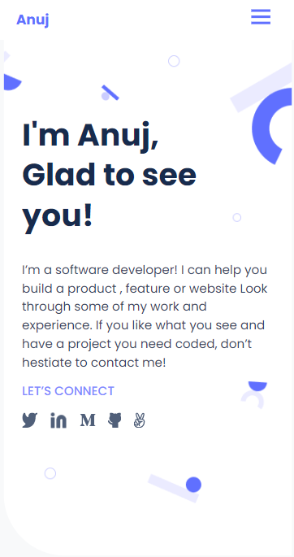
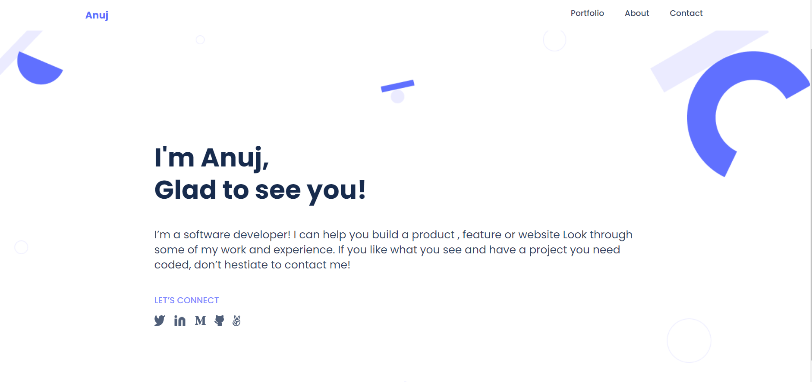

#Portfolio Project
### Mobile View

### Desktop View

> This my Portfolio Project in the Microverse curriculum

## Built With
- Html
- CSS
- GITHub

## Getting Started
 To get a local copy up and running follow these simple example steps.
- Clone this repository or download the Zip folder:
git clone https://github.com/mr-anuj/Portfolio.git
- Navigate to the location of the folder in your machine

## Authors

👤 **Anuj Chettri**

- GitHub: [@githubhandle](https://github.com/mr-anuj)

## Contributing
Contributions, issues, and feature requests are welcome!

## Show your support
Give a ⭐️ if you like this project!

## Acknowledgments
- Hat tip to anyone whose code was used
- Inspiration
- etc
## License
This project is [MIT]()

